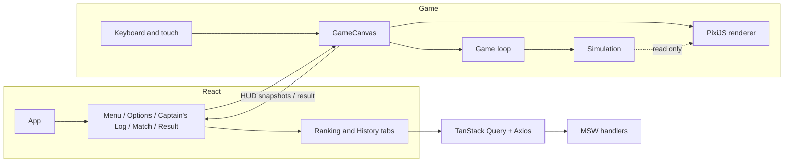

# Architecture

This document describes the main decisions behind Pirate Battle. For setup, commands and controls see the [README](README.md).

## Overview

Responsibilities are split in four layers that only talk through small, explicit interfaces:

| Layer | Location | Knows about |
| --- | --- | --- |
| Rules (simulation) | `src/game/simulation` | Nothing else: no PixiJS, no DOM |
| Rendering | `src/game/render` | Reads the simulation state, never mutates it |
| Input | `src/game/input` | DOM events; produces an `InputState` |
| UI state | `src/ui`, `src/App.tsx`, `src/api` | React, TanStack Query, `localStorage` |

## React and PixiJS integration

- `GameCanvas` is the only bridge. It creates the world, the input sources and the renderer in a single effect and tears all of them down in its cleanup.
- Continuous combat state lives in the simulation (`WorldState`), not in React. React receives only discrete events: a **HUD snapshot** (score, whole seconds left, health) emitted when one of those values changes (about once per second plus damage), and a single **result** when the match ends. React never re-renders per frame.
- `MatchScreen` first loads the textures (progress bar, error and retry) and only mounts `GameCanvas` once they are ready, so the match timer starts after loading.
- Config and callbacks are read once or through refs, so re-rendering the React tree never restarts a match. Every new match remounts the component (a changing `key`) and gets a fresh world.

### React Strict Mode

Pixi's `Application.init` is asynchronous, so Strict Mode's mount, unmount, mount sequence can finish an `init` after its effect was already cleaned up. `createPixiRenderer` receives an `AbortSignal`; if it is aborted during `init`, the application is destroyed and `null` is returned before the canvas touches the DOM. `destroy()` is idempotent. Failures during startup are logged only when the effect is still active.

## Simulation cycle

`src/game/loop/gameLoop.ts` runs a **fixed-step** loop (1/60 s) driven by `requestAnimationFrame` and an accumulator, with a cap on the time of a single frame (0.25 s) to avoid a spiral of death. Rendering happens once per animation frame. Because every rule uses `dt`, movement, damage, cooldowns and spawns do not depend on the frame rate.

`stepWorld(world, input, dt)` executes, in order:

1. Player: rotation, acceleration with drag (forward speed along the heading), island push-out, arena clamp, cooldowns and firing.
2. Spawner: spawns enemies each `spawn.interval` seconds.
3. Enemies: steering, Shooter firing, island and arena collision, Chaser contact.
4. Projectiles: movement, expiry and collisions.
5. Scoring: enemies at zero health are removed (1 point each).
6. End conditions: death first, then time.

Once `match.status` is `over`, `stepWorld` returns immediately, so nothing moves, fires, takes damage, spawns or scores. A seeded PRNG (`mulberry32`) drives all randomness, which makes matches reproducible in tests.

### Pause

Manual pause, window blur and tab visibility changes all set one `paused` flag. Pausing **stops the loop**, which discards the accumulator, so resuming never replays the paused interval. The keyboard source is disabled (and cleared) and touch input is reset, so held keys do not carry over. Resuming always needs a player action.

## Collisions

Everything is a circle, which keeps the tests cheap and predictable:

- **Ship and island:** the ship is pushed out along the normal and its velocity is zeroed (it cannot cross).
- **Ship and arena:** the position is clamped to the arena bounds minus the ship radius.
- **Projectile and island / arena:** the projectile is removed. Projectiles also expire after their lifetime (range).
- **Projectile and ship:** player projectiles hit the first live enemy; enemy projectiles hit the player. The projectile is removed on impact, so damage is applied exactly once.
- **Chaser and player:** on overlap the player takes contact damage and the Chaser is removed without scoring.
- **Spawn points:** sampled randomly within the arena and accepted only if they are clear of the island (plus a margin) and of other enemies, and far enough from the player. If sampling fails, a grid is scanned and the clear point farthest from the player is used.
- **Enemy kinds:** each spawn rolls a kind by `chaserChance`, but the second spawn is always the kind that has not appeared yet, so every match with two or more spawns has both a Chaser and a Shooter.
- **Enemies and the island:** `navigate` checks whether the straight line to the player crosses the island. If so, the enemy heads for the tangent of an enlarged circle around the island, on a side chosen once and kept until the line is clear (no oscillation when the player is exactly behind the island). Shooters do not fire while the island blocks the line.

## Rendering and resource management

- `createPixiRenderer` builds the scene once (tiled water, island sprite, ship sprites, pooled projectile sprites, health bars, effects) and updates it from the world on each `render`.
- **Textures** are loaded once through `Assets` (`loadGameTextures`) and cached at module level, so they are reused across matches. A failed load is not cached, which makes the "Try again" button work. The textures are shared and therefore **not** destroyed with the application.
- **Damage deterioration:** each ship has four hull sprites (intact to heavily damaged) selected from its health ratio, plus a fire sprite below 50 % health. Hits flash the hull.
- **Effects:** the simulation appends `SimEvent`s (`shot`, `hit`, `explosion`) to a short list. The renderer remembers the last event id it handled and animates each effect from the simulation time, so effects freeze with the simulation when paused.
- **Canvas:** the renderer uses `resolution = min(devicePixelRatio, 2)` and `autoDensity`; CSS scales the canvas to its container preserving the aspect ratio.
- **Cleanup:** leaving a match aborts the init signal, removes the keyboard listeners, stops the loop and destroys the Pixi application with its children. No timers or listeners outlive the match.

## UI, layout and accessibility

- **Navigation:** `App` holds a small screen state (`menu`, `options`, `log`, `match`, `result`). The Ranking and Match History buttons on the menu open the Captain's Log on the chosen tab.
- **Look:** panels, buttons, counters and icons use the supplied UI sprites. The panel uses `border-image` with the 9-slice borders from `ui_sheet.json`; buttons are stretched backgrounds with hover, pressed and disabled variants.
- **Match layout:** the match screen is a column (HUD, arena, touch pads). On portrait screens the HUD gets its own row; on landscape and desktop the HUD floats over the arena and, on touch devices, the pads float over it too. The touch pad size derives from the viewport width so both pads fit any phone.
- **Focus:** the pause dialog uses `useFocusTrap`, which keeps Tab inside the dialog and restores the previous focus on close. The Captain's Log tabs use roving `tabIndex` and arrow, Home and End keys.
- **Screen reader output:** the HUD renders its values with visually hidden labels (Score: 3, Time: 80s, Health: 90/100) and is not live. A separate polite live region announces only pausing and critical health (25 % or less), derived from state during render, so the timer is never announced every second.
- **Forms:** validation errors are rendered with `role=alert` and linked through `aria-describedby`; invalid inputs set `aria-invalid`.

## Audio

`src/game/audio/` has two parts:

- `audioEngine.ts` owns a single Web Audio `AudioContext` with a master gain. It decodes the WAV files into buffers (`loadSounds`), plays one-shots (`playSound`) and loops (`startLoop`), and holds the mute flag (persisted in `localStorage`). The context is created only after the first user gesture, which satisfies browser autoplay rules; `installUiSounds` creates it on the first pointer or key press and plays a click for every UI button.
- `gameAudio.ts` turns the simulation into sound. Like the renderer it only reads the world: it handles each new `SimEvent` once (`shot`, `hit`, `collision`, `splash`, `explosion`) and derives the rest from state (score increases, health at or below 25 %, 10 seconds left, match end). A broadside emits one event per cannon, so the broadside sound is played once per volley. An ocean loop plays during the match and a sailing loop follows the ship speed. Pausing silences the loops and plays the pause cue.

Sound is optional by design: files that fail to load are logged and skipped, so loading problems never block a match. Sounds are loaded together with the textures (shared progress bar). The E2E suite does not load or play sounds, because it steps the simulation manually.

## Profiling mode

`?perf` in the URL turns on a profiling mode used by `npm run perf` (`perf/profile.spec.ts`): the match runs in real time, the player cannot die (so the whole duration is played), and `src/game/perf.ts` records, per frame, the frame interval, the CPU time of the simulation and of `renderer.render`, and the entity count. The report of the last match is left in `window.__perfLast`. Results and methodology are in [docs/performance/PERFORMANCE.md](docs/performance/PERFORMANCE.md).

## Input

`createKeyboardInput` and the touch input produce the same `InputState`; `mergeInputs` combines them every step, so keyboard and touch can be used together. Keyboard listeners exist only while a match is mounted, so game keys are not captured in menus. Touch buttons use pointer events with pointer capture and release on cancel or lost capture.

## Local persistence

All access goes through `src/storage.ts` (and the mock database in `src/mocks/db.ts`). Reads are defensive: stored JSON is parsed and validated, and anything invalid falls back to defaults. Writes swallow storage errors, so the game keeps working without persistence.

| Key | Content |
| --- | --- |
| `pirate-battle:options` | Options (validated against the limits) |
| `pirate-battle:last-result` | Last finished match, shown on the menu after a refresh |
| `pirate-battle:pending-matches` | Matches awaiting confirmation |
| `pirate-battle:player` | Stable local player id and name |
| `pirate-battle:muted` | Sound preference |
| `pirate-battle:mock-matches` | Confirmed matches of the mock API |
| `pirate-battle:mock-scenario` | Selected network scenario |

An abandoned match (reload or leaving the combat screen) is never recorded, because registration happens only from the match-finished callback.

## Ranking and history integration

### Contracts

Defined in `src/api/contracts.ts`: `MatchRecord` (`id`, `playerId`, `playerName`, `playedAt`, `score`, `duration`, `reason`, `options`), `RankingEntry` (a record plus `rank`) and `Page<T>` (`items`, `page`, `pageSize`, `total`, `totalPages`).

### Reads

`useRanking` and `useHistory` (`src/api/queries.ts`) wrap `useQuery`:

- Keys: `['ranking', matchDuration, spawnInterval, page]` and `['history', playerId, page]`. Every page has its own cache entry, so a late response for another page can never overwrite the current one.
- `placeholderData: keepPreviousData` keeps the previous page visible while the next one loads; `refetchOnMount: 'always'` refreshes a tab each time it is shown.
- Defaults: one retry after 500 ms, no refetch on window focus.
- The UI handles loading, empty and error states, and shows an alert when a background refresh fails while showing the last loaded page.
- The ranking only compares matches played with the same options, ordered by score (descending), duration (ascending), date (ascending) and `id`.

### Writes: idempotent registration

`useMatchSync` (`src/api/useMatchSync.ts`) is created once in `App`:

1. When a match ends, its `MatchResult` already carries a generated `id`. The record is added to the **pending list** in `localStorage` and then submitted.
2. `POST /api/matches` is idempotent by `id`: the server returns `201` for a new record and `200` with the existing one if it was already stored. Repeated clicks and retries therefore never duplicate an entry, and an in-flight guard avoids concurrent sends of the same id.
3. The mutation retries twice with exponential back-off (500 ms, 1 s). On success the record leaves the pending list and both query families are invalidated, so the ranking and the history refresh.
4. On failure the record stays pending. The result screen shows `saving`, `saved` or `failed` (with a Retry button), the next app load resends every pending record, and the player can start another match meanwhile.

API failures never block the game, the options or a running match.

### Mock API

MSW handlers (`src/mocks/handlers.ts`) share contracts, fixtures and scenarios with development, the E2E tests and the published build. The service worker starts before React renders. The scenario is read on every request from `localStorage`, so it can be changed at runtime or seeded by tests. See the README for the list of scenarios.

## Testing approach

Playwright drives the real app in Chromium (desktop and mobile profiles) against the production build. To make combat reproducible without faking game logic, a `?e2e` URL flag:

- fixes the PRNG seed (`seed=N`);
- replaces the real-time loop with manual stepping through `window.__game.advance(seconds)`, which runs the same `stepWorld` with the real keyboard and touch inputs;
- exposes a read-only `snapshot()` of the world.

Seeds are chosen on purpose: seed 7 produces a Chaser as the first enemy, so a player standing still survives a 60 s match with a 30 s spawn interval; seed 1 reliably kills a stationary player. Spawning and enemy navigation are also covered by node-level simulation tests (`e2e/simulation.spec.ts`) that run `stepWorld` directly without a browser.

Other suites: `accessibility.spec.ts` (focus trap, keyboard navigation, touch controls that are hidden with a fine pointer and drive the ship on the mobile profile, layout fitting the screen) and `visual.spec.ts` (menu, Captain's Log, arena and result screen). Baselines are versioned in `e2e/visual.spec.ts-snapshots/` and are platform specific (generated on Windows). The suite covers options, movement and limits, firing and cooldowns, both ending conditions, restart, ranking and history states, registration, recovery from a lost response and from a refresh, and visual regression of the menu, arena and result screens.

## Balance decisions

Default values (`defaultConfig`) favor readability over difficulty:

| Parameter | Value |
| --- | --- |
| Match duration / spawn interval | 90 s / 3 s |
| Player health / max speed / turn rate | 100 / 180 px/s / 2 rad/s |
| Forward shot | 10 damage, 0.4 s cooldown |
| Broadside | 3 projectiles, 8 damage each, 1 s cooldown |
| Chaser | 20 health, 110 px/s (slower than the player), 25 contact damage |
| Shooter | 40 health, 70 px/s, 10 damage per shot every 1.8 s, preferred distance 260 px, range 380 px |
| Spawn chance | 50 % Chaser, minimum 300 px from the player |

The Chaser is slower than the player so it can be outrun and shot; the Shooter stops at a preferred distance instead of ramming, which makes it a target that rewards flanking.

## Limitations

- Enemies steer around the island with a simple tangent detour, not full path-finding; other obstacles would need a real navigation approach.
- Only a subset of the network failures from the challenge is simulated (success, empty, slow, HTTP 500, unavailable submit, lost response). Variable latency, out-of-order responses, 4xx responses and per-endpoint failures are not implemented yet.
- Both orientations are supported on mobile, but the layout was only checked on the Pixel 7 profile used in the tests.
- Color contrast was judged visually and has not been measured with a tool.
- Audio output is not covered by the automated tests (the E2E suite does not load sounds); it has to be checked by ear.
- Ship sprites use the 1x assets; high density screens may look slightly soft.
- Visual baselines are platform specific.
